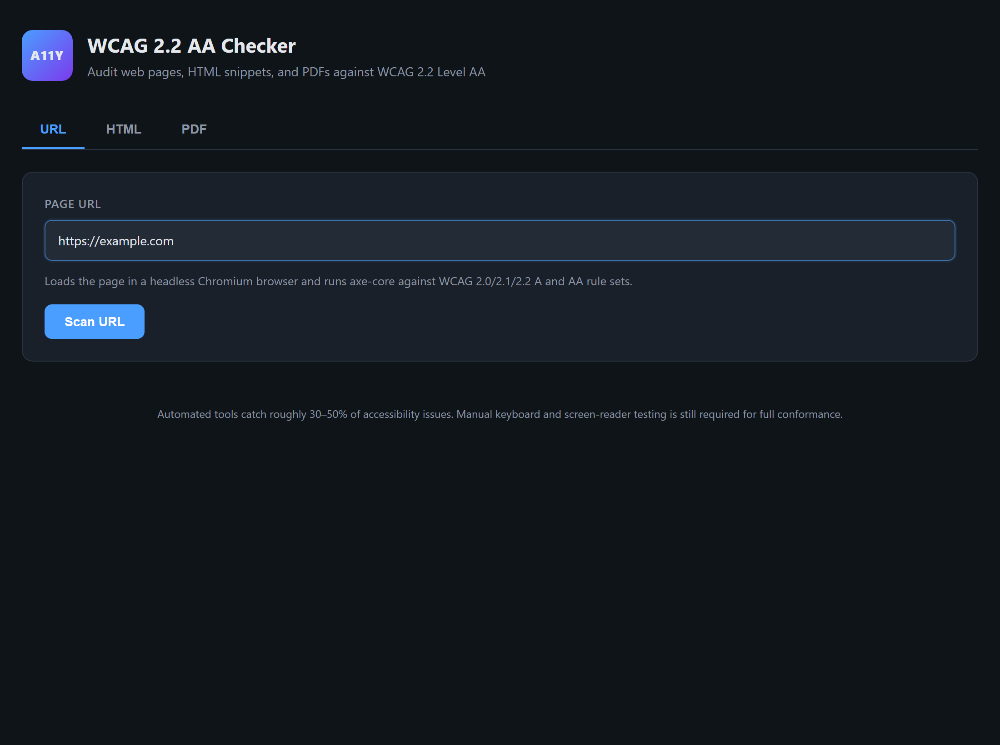

# WCAG Checker

[](https://github.com/sammierosado/wcag-checker/actions/workflows/ci.yml)
[](./LICENSE)
[](https://nodejs.org)
[](https://www.w3.org/TR/WCAG22/)
[](https://github.com/dequelabs/axe-core)
[](https://verapdf.org/)

A local web app that audits web pages, HTML snippets, and PDFs against **WCAG 2.2 Level AA**. Built for accessibility consultants and devs who need client-ready reports without sending content to a third-party SaaS.



- **Web (URL / HTML)** — powered by [axe-core](https://github.com/dequelabs/axe-core) running in headless Chromium via Playwright.
- **PDFs** — powered by [veraPDF](https://verapdf.org/), the reference PDF/UA-1 (ISO 14289-1) validator, with each failing rule mapped to the WCAG 2.2 success criteria it impacts.
- **Local-only** — your URLs, HTML, and documents never leave your machine.
- **Exports** — self-contained HTML report for clients, plus raw JSON for tooling.

## Quick start

```bash
git clone https://github.com/sammierosado/wcag-checker.git
cd wcag-checker
npm install
npm start
```

Then open <http://localhost:5173>.

The server binds to `127.0.0.1` (localhost-only) by default so it is never exposed on your network. To reach it from another device, start it with `HOST=0.0.0.0 npm start`. Change the port with `PORT=8080 npm start`.

The `postinstall` step downloads Playwright's Chromium and the veraPDF validator (~150MB combined, one-time).

## Requirements

| Tool | Version | Why |
|------|---------|-----|
| Node.js | 18 or newer | runtime |
| Java | 11 or newer (`java` on PATH) | required by veraPDF |
| OS | Windows, macOS, Linux | all supported |

If `java` isn't installed, the install script will skip veraPDF and warn you — web/HTML scans will still work; PDF scans will fail until Java is available.

## Usage

### 1. URL scan
Paste any public URL. The page loads in a headless browser, then axe-core runs every WCAG 2.0/2.1/2.2 A and AA rule against the live DOM.

### 2. HTML scan
Paste an HTML snippet or a full document. Useful for auditing email templates, CMS fragments, or design-system components in isolation.

### 3. PDF scan
Drag a PDF in. veraPDF validates it against PDF/UA-1 and the results are mapped to the WCAG 2.2 success criteria your clients' audit reports use (1.3.1, 3.1.1, 4.1.2, etc.).

### Reports

Every scan can be exported as:

- **Self-contained HTML** — single file, no external assets, ready to email to a client.
- **Raw JSON** — machine-readable, suitable for CI pipelines or further tooling.

## Architecture

```
Browser UI  ─►  Express server  ─►  Scanner       ─►  Normalizer  ─►  unified JSON
   (public/)     (server.js)        (lib/scanWeb,                     │
                                     lib/scanPdf)                     ├─►  UI render
                                                                      └─►  HTML report (lib/report.js)
```

Both scanners normalize their output to a single shape so the UI and report generator don't care which engine produced the result.

## What's covered (and what isn't)

Automated tools catch roughly **30–50%** of accessibility issues — the rest require manual keyboard navigation and screen-reader testing. This tool is a strong first pass, not a replacement for a full audit.

The PDF/UA → WCAG mapping (`lib/scanPdf.js`) is intentionally coarse-grained — it points each failing PDF/UA clause at the most relevant WCAG SC. For a rigorous Matterhorn Protocol mapping, consult the [PDF Association's Matterhorn Protocol 1.1](https://pdfa.org/resource/the-matterhorn-protocol/).

## Project layout

```
wcag-checker/
├── server.js               # Express server + endpoints
├── lib/
│   ├── scanWeb.js          # axe-core via Playwright
│   ├── scanPdf.js          # veraPDF subprocess wrapper
│   └── report.js           # self-contained HTML report generator
├── public/                 # single-page UI
│   ├── index.html
│   ├── style.css
│   └── app.js
├── scripts/
│   └── install-verapdf.js  # postinstall: downloads + installs veraPDF
├── vendor/verapdf/         # installed locally (gitignored)
└── uploads/                # temp PDF uploads (gitignored, auto-cleaned)
```

## Troubleshooting

| Symptom | Fix |
|---------|-----|
| **PDF scans fail / "veraPDF returned no output"** | veraPDF needs Java 11+ on your PATH. Run `java -version` to confirm, then re-run `npm run install:verapdf`. |
| **`browserType.launch: Executable doesn't exist`** | Playwright's Chromium didn't download. Run `npx playwright install chromium`. |
| **Port 5173 already in use** | Start on another port: `PORT=8080 npm start`. |
| **`postinstall` failed behind a proxy/firewall** | Re-run `npm run install:verapdf` and `npx playwright install chromium` once you have network access. Web/HTML scans work without veraPDF. |
| **A URL scan times out** | The page must load within 45s and return HTTP 200. Pages behind a login or heavy JS may not finish; try the HTML tab with the rendered markup instead. |

## Credits & licenses

This project is MIT-licensed (see `LICENSE`). It depends on:

| Project | License | Role |
|---------|---------|------|
| [axe-core](https://github.com/dequelabs/axe-core) | MPL 2.0 | Web accessibility rule engine |
| [Playwright](https://playwright.dev/) | Apache 2.0 | Headless browser automation |
| [veraPDF](https://verapdf.org/) | **GPL v3+ / MPL v2** (dual) | PDF/UA validation |
| [Express](https://expressjs.com/) | MIT | HTTP server |
| [Multer](https://github.com/expressjs/multer) | MIT | File upload handling |

**veraPDF is dual-licensed under GPL v3+ and MPL v2.** This project does not redistribute veraPDF binaries — they are downloaded at install time from the official source. If you redistribute a derivative of this project that *does* bundle veraPDF, you must comply with one of veraPDF's license terms.

## Contributing

PRs welcome — particularly:

- Tighter PDF/UA → WCAG mapping (Matterhorn Protocol coverage)
- Additional report formats (CSV issue list, formal PDF report)
- Better remediation guidance per rule

## License

[MIT](./LICENSE) — see the LICENSE file.
